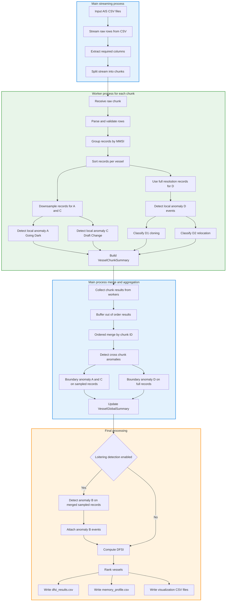

# BigdataprojectVU

Shadow Fleet Anomaly Detection on AIS Data

---

## Project task

The goal of this project is to process large-scale AIS (Automatic Identification System) data and detect suspicious vessel behavior associated with the so-called *shadow fleet*.

The system identifies several types of anomalies:

- **A — Going Dark**  
  Long AIS gaps where the vessel likely continued moving.

- **B — Loitering & Transfers**  
  Two vessels staying close together at low speed for a prolonged time at sea.

- **C — Draft Changes at Sea**  
  Significant draught changes during AIS blackout outside port areas.

- **D — Identity Issues (Teleportation)**  
  - **D1**: near-simultaneous MMSI cloning  
  - **D2**: impossible relocation requiring unrealistic speed  

Finally, each vessel is assigned a **DFSI (Dark Fleet Suspicion Index)** score.

---

## Main detection pipeline



- The main process performs CSV streaming, chunk creation, ordered merge, and final aggregation.
- Worker processes handle per chunk parsing, validation, grouping, and local anomaly detection.
- Cross chunk anomaly detection is performed during incremental merge in the main process.

### Pipeline explanation

The pipeline is designed as a **streaming + multiprocessing system**:

- The **main process** performs lightweight work:
  - streaming AIS CSV files
  - extracting required columns
  - splitting data into fixed-size chunks

- **Worker processes** handle CPU-intensive computation per chunk:
  - parsing and validating AIS records
  - grouping records by vessel (MMSI)
  - sorting records by timestamp
  - detecting **local (intra-chunk) anomalies**:
    - A (Going Dark) and C (Draft Change) on sampled records
    - D (Teleportation) on full-resolution records

- The **main process incrementally merges results in strict chunk order**:
  - buffers out-of-order worker results
  - merges chunk summaries sequentially
  - detects **cross-chunk (boundary) anomalies**
  - aggregates global vessel statistics

- Optional step:
  - anomaly B (Loitering & Transfers) is computed **after full merge**
  - uses globally merged sampled records across all vessels

- Final stage:
  - DFSI (Dark Fleet Suspicion Index) is computed per vessel
  - results and visualization datasets are exported

---

## Project structure

```text
.
├── data/
│   ├── full/              # full AIS dataset placeholder / input location
│   ├── output/            # detection results and exported CSV files
│   ├── sample/            # sample AIS datasets for testing
│   └── ports_dma_region.csv
├── scripts/
│   └── run_detection.py   # main CLI entry point
├── slides/
│   └── presentation.pdf
├── src/
│   ├── anomaly_detection/ # anomaly rules, merge logic, DFSI scoring
│   ├── models/            # AIS records, events, processing summaries
│   ├── parallel/          # worker pool logic
│   ├── performance/       # memory profiling
│   ├── streaming/         # CSV reading, raw row extraction, chunking
│   ├── utils/             # geo and port utilities
│   └── config.py
├── visualization/         # plotting and map generation scripts
├── CONTRIBUTING.md
├── README.md
└── requirements.txt
```

---

## Output files

- dfsi_results.csv — final ranking of vessels  
- memory_profile.csv — memory usage over time  
- visualization datasets for anomalies A, B, D  

---

## How to run

### Minimal example

```bash
python -m scripts.run_detection data/sample/2025-09-01_head_100_000_rows.csv \
    --chunk-size 100000 \
    --workers 4
```

### Example with optional arguments
```bash
python -m scripts.run_detection \
    data/sample/2025-09-01_head_100_000_rows.csv \
    --chunk-size 100000 \
    --workers 4 \
    --top 10 \
    --output data/output/dfsi_results.csv \
    --memory-output data/output/memory_profile.csv \
    --teleportation-d1-viz-output data/output/top_teleportation_d1_vessel_map.csv \
    --teleportation-d2-viz-output data/output/top_teleportation_d2_vessel_map.csv \
    --going-dark-viz-output data/output/top_going_dark_vessel_map.csv \
    --loitering-viz-output data/output/top_loitering_vessel_map.csv \
    --enable-loitering-detection
```

### Main arguments

| Main argument              | Desc |
|----------------------------|------|
| input_files                | one or more AIS CSV files |
| chunk-size                 | number of raw rows per chunk |
| workers                    | number of worker processes |
| top                        | number of top vessels to display |
| output                     | final DFSI results CSV |
| memory-output              | memory profiling CSV |
| enable-loitering-detection | enables anomaly B detection |


---

## DFSI formula

```
DFSI = (Max Gap Hours / 2)
     + (D2 Distance in Nautical Miles / 10)
     + (Draft Changes * 15)
```

---

## Contributing
Please see [CONTRIBUTING.md](./CONTRIBUTING.md) for the branching strategy, pull request process, and repository workflow.
