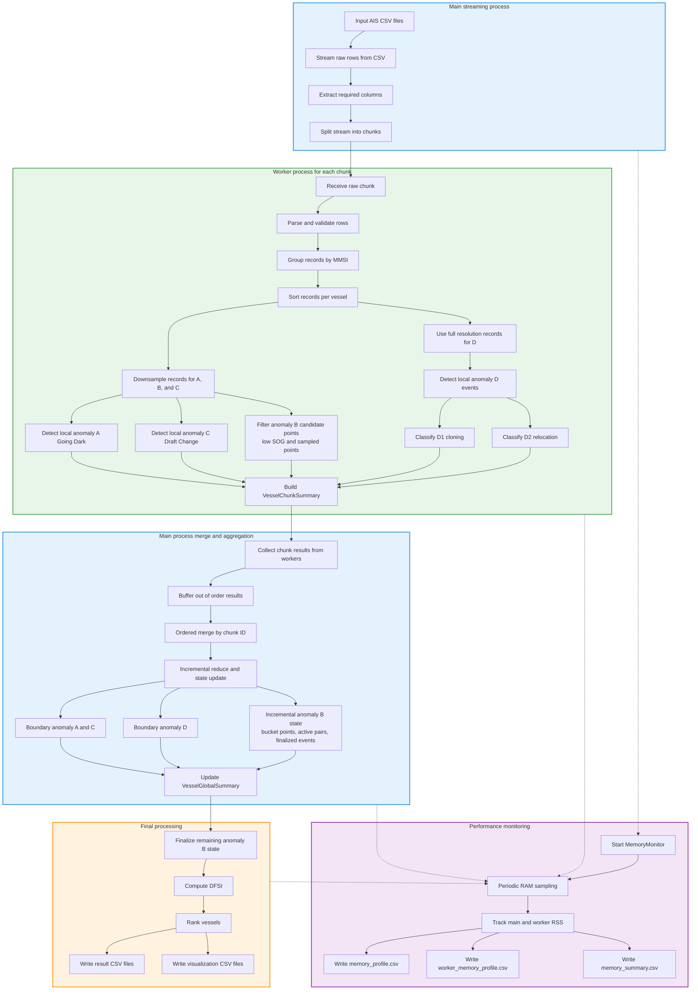

# BigdataprojectVU

Shadow Fleet Anomaly Detection on AIS Data

---

## Project task

The goal of this project is to process large-scale AIS (Automatic Identification System) data and detect suspicious vessel behavior associated with the so-called *shadow fleet*.

The system identifies several types of anomalies:

- **A — Going Dark**  
  Long AIS gaps where the vessel likely continued moving.

- **B — Loitering & Transfers**  
  Two vessels staying within 500 meters of each other, with speed < 1 knot, for more than 2 hours at sea.

- **C — Draft Changes at Sea**  
  Significant draught changes during AIS blackout outside port areas.

- **D — Identity Issues (Teleportation)**  
  - **D1**: near-simultaneous MMSI cloning  
  - **D2**: impossible relocation requiring unrealistic speed  

Finally, each vessel is assigned a **DFSI (Dark Fleet Suspicion Index)** score.

---

## Key design decisions

- streaming processing instead of full dataset loading
- multiprocessing with heavy computation pushed to worker processes
- incremental stateful merge instead of batch aggregation
- separation of local (intra-chunk) and cross-chunk anomaly detection
- in-memory processing without intermediate disk materialization

---

## Main detection pipeline



- The main process performs CSV streaming, chunk creation, ordered merge, and final aggregation.
- Worker processes handle per-chunk parsing, validation, grouping, local anomaly detection, and anomaly B candidate-point preparation.
- Cross-chunk anomaly detection is performed during incremental merge in the main process.
- Anomaly B is maintained incrementally during ordered merge using time buckets and rolling vessel-pair state.
- A lightweight memory profiler runs alongside the pipeline:
  - periodically samples RAM usage of the main and worker processes
  - produces aggregated and per-worker memory profiles for performance analysis

---

### Pipeline explanation

The pipeline is designed as a **streaming + multiprocessing system**:

- The **main process** performs lightweight work:
  - streaming AIS CSV files
  - extracting required columns
  - splitting data into fixed-size chunks

- **Worker processes** handle CPU-intensive computation per chunk:
  - parsing and validating AIS records
  - grouping records by vessel (MMSI)
  - sorting records by timestamp
  - detecting **local (intra-chunk) anomalies**:
    - A (Going Dark) and C (Draft Change) on sampled records
    - D (Teleportation) on full-resolution records
  - preparing sampled low-speed candidate points used later for anomaly B detection

- The **main process incrementally merges results in strict chunk order**:
  - buffers out-of-order worker results
  - merges chunk summaries sequentially
  - detects **cross-chunk (boundary) anomalies**
  - updates global vessel statistics
  - updates anomaly B state incrementally using:
    - time buckets
    - active vessel-pair state
    - finalized loitering events

- Final stage:
  - remaining anomaly B state is finalized
  - DFSI (Dark Fleet Suspicion Index) is computed per vessel
  - result and visualization CSV files are exported

---

## Performance benchmarking

The pipeline is evaluated under different configurations:

- number of workers
- chunk size (streaming granularity)

### Metrics

- total execution time
- peak memory usage
- throughput

### Speedup

S(n) = T(1) / T(n)

### Amdahl’s Law

S(n) = 1 / ((1 - P) + P / n)

---

## Project structure

```text
.
├── data/
│   ├── full/              # full AIS dataset placeholder / input location
│   ├── output/            # detection results and exported CSV files
│   ├── sample/            # sample AIS datasets for testing
│   └── ports_dma_region.csv
├── scripts/
|   └──run_detection.py (as main endpoint)
├── src/
│   ├── anomaly_detection/ # anomaly rules, merge logic, DFSI scoring
│   ├── models/            # AIS records, events, processing summaries
│   ├── parallel/          # worker pool logic
│   ├── performance/       # memory profiling
│   ├── streaming/         # CSV reading, raw row extraction, chunking
│   ├── utils/             # geo and port utilities
│   └── config.py
├── visualization/         # plotting and map generation scripts
├── visualization/
|   └──run_plots.py (as vis endpoint)
├── analysis/
|   └──performance_benchmarking.ipynb
├── README.md              # You are here :)
├── CONTRIBUTING.md
├── LICENSE
└── requirements.txt
```

---

## Output files

- dfsi_results.csv
- memory_profile.csv
- worker_memory_profile.csv
- memory_summary.csv
- visualization datasets

---

## How to run

### Minimal example

```bash
python -m scripts.run_detection data/sample/file.csv --chunk-size 100000 --workers 4
```

### Example with optional arguments

```bash
python -m scripts.run_detection \
    data/sample/2025-09-01_head_100_000_rows.csv \
    --chunk-size 100000 \
    --workers 4 \
    --top 10 \
    --output data/output/dfsi_results.csv \
    --memory-output data/output/memory_profile.csv \
    --teleportation-d1-viz-output data/output/top_teleportation_d1_vessel_map.csv \
    --teleportation-d2-viz-output data/output/top_teleportation_d2_vessel_map.csv \
    --going-dark-viz-output data/output/top_going_dark_vessel_map.csv \
    --loitering-viz-output data/output/top_loitering_vessel_map.csv
```

---

## Main arguments

| Main argument              | Desc |
|----------------------------|------|
| input_files                | one or more AIS CSV files |
| chunk-size                 | number of raw rows per chunk |
| workers                    | number of worker processes |
| top                        | number of top vessels to display |
| output                     | final DFSI results CSV |
| memory-output              | memory profiling CSV |
| disable-loitering-detection| disables anomaly B detection |

---

## DFSI formula

DFSI = (Max Gap Hours / 2)
     + (Draft Changes * 15)  
     + (D1 Episodes * 20)
     + (D2 Distance (valid only) in nautical miles / 10)  

### D1 aggregation strategy

D1 (near-simultaneous MMSI cloning) events are aggregated into **temporal episodes** 
to avoid overcounting due to AIS sampling density.

- Consecutive D1 events are merged into a single episode if they occur within a 2-hour window.
- The DFSI uses the number of such episodes (`D1 Episodes`) instead of raw event count.

This ensures that one physical spoofing incident is not counted multiple times 
due to high-frequency AIS reporting.

### D2 quality filtering

D2 (impossible relocation) events are subject to additional validation:

- Events with coordinates located on land (based on a coarse land mask)  
  are flagged as low-quality and excluded from DFSI calculation.
- Only validated D2 events contribute to the DFSI distance component.

This reduces the impact of corrupted AIS data and coordinate errors.

---

## Contributing

See [CONTRIBUTING.md](./CONTRIBUTING.md) for the branching strategy, pull request process, and repository workflow.
